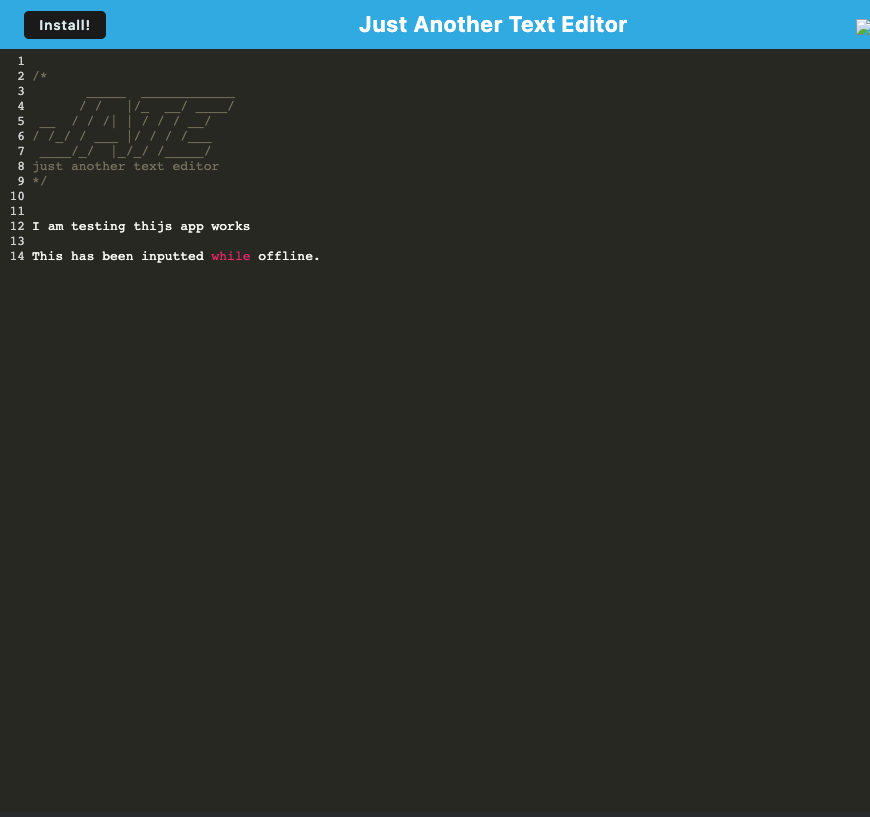

# Just Another Text Editor

Browser-based text editor with offline and installation capacity.

         

---

[About](#about) ✦ [Usage](#usage) ✦ [Resources](#resources) ✦ [License](#license) ✦ [Contact](#contact)

---

## About

This text editor is a single-page application that runs in the browser. It meets the PWA criteria as well as being able to work offline and can be installed.

This application uses the idb package for storage methods and webpack for bundling. The service worker is created with workbox. The use of Babel allows for asyn/await within the code.

## Usage

Please visit the application URL below:

https://ancient-cliffs-60610.herokuapp.com/

## Resources

https://web.dev/codelab-make-installable/

## License

This project is using the following license:

**MIT**

For further information regarding the license, please follow the link below:
https://opensource.org/licenses/MIT

---

## Contact

If you have any further questions, please contact via email or github.

 
